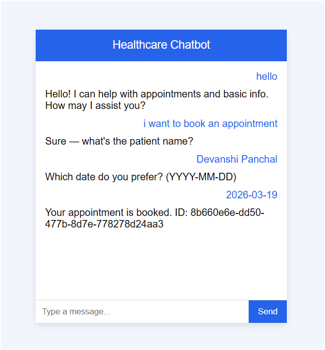

# Healthcare AI Chatbot

## Overview

This project is a Healthcare Chatbot built using **Rasa, FastAPI, and Docker**.
The chatbot can interact with users, collect symptoms, and book doctor appointments automatically.

The system uses Natural Language Processing (NLP) to understand user queries and provide healthcare assistance.

---

## Features

* Chatbot interaction with patients
* Appointment booking system
* Symptom input from users
* FastAPI microservice for appointment management
* Docker containerized architecture

---

## Technology Stack

* **Rasa** – Conversational AI framework
* **Python** – Backend logic
* **FastAPI** – Appointment service API
* **Docker & Docker Compose** – Container orchestration
* **HTML / JavaScript** – Chatbot frontend

---

## Project Architecture

Frontend (HTML Chat UI)
↓
Rasa Chatbot (NLP & Dialogue Management)
↓
Action Server (Custom Python Actions)
↓
FastAPI Appointment Service
↓
Database (Future enhancement)

---

## Project Structure

healthcare-ai-chatbot
│
├── actions/
├── appointment_service/
├── frontend/
├── data/
├── domain.yml
├── config.yml
├── endpoints.yml
├── docker-compose.yml
└── README.md

---

## How to Run the Project

### Step 1 – Clone the repository

```
git clone git clone https://github.com/devanshipanchal/Healthcare-ai-chatbot.git
```

### Step 2 – Start Docker containers

```
docker compose up -d
```

### Step 3 – Open chatbot

```
http://localhost:8080
```

---

## Chatbot Interface



## Future Improvements

* Automatic symptom detection
* Doctor recommendation system
* Store appointments in database
* AI-based disease prediction
* Improved chat UI

---

## Author

Devanshi Panchal
